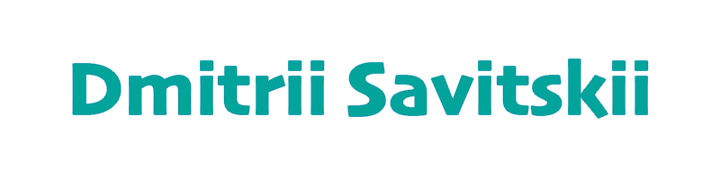

# Привет, меня зовут Дмитрий! 
---
### :man_technologist: Обо мне:
Я начинающий Python-разработчик. В 2023 году начал
изучать язык программирования Python. Прошел два курса на образовательной платформе stepik.org и начал практиковать программирование на собственном проекте. На данный прохожу 3-й курс по программированию на языке Python, изучаю MySQL и другие технологии.

### 💻 Пройденные курсы:

| Курсы                                                           | Дата              |
| ----------------------------------------------------------------| :---------------: |
| Интерактивный тренажер по SQL                          | 10/2022 - н.в |
| "Поколение Python": курс для профессионалов            | 06/2022 - н.в |
| "Поколение Python": курс для продвинутых               | 04/2023 - 04/2023 |
| "Поколение Python": курс для начинающих                | 02/2023 - 03/2023 |

- :mailbox: Контакты:  

---

### 🤝 Социальные сети:

  

    
    
    
    
    

  

---

### 💻 Технологии:

  &nbsp
  &nbsp
  &nbsp
  &nbsp
  <!-- &nbsp; -->

---

### 🛠 Инструменты:

  &nbsp;
  &nbsp;
  &nbsp;
  &nbsp;
  &nbsp;

---

### 💻 Codewars:

<!--  -->
